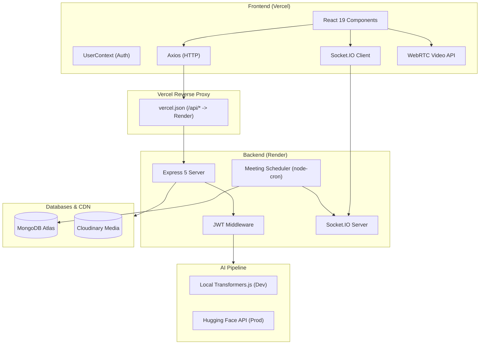

# SConnect — AI-Powered Professional Networking Platform

SConnect is a full-stack, LinkedIn-inspired professional networking platform built with the MERN stack. It features real-time meeting rooms with Socket.IO chat, peer-to-peer WebRTC video calling, automated meeting scheduling, and 3 embedded AI capabilities powered by Hugging Face Transformer models.

---

## Key Features

###  AI & Machine Learning
- **AI Meeting Summarizer**: Uses `DistilBART-CNN` (knowledge-distilled BART model) to automatically generate abstractive, concise meeting summaries from chat logs.
- **Semantic People Search**: Embeds user profiles into 384-dimensional dense vectors using `all-MiniLM-L6-v2` (Sentence-Transformers). Search queries are embedded at runtime and matched via **cosine similarity** to understand search intent (e.g. searching *"ML engineer"* matches *"Machine Learning Researcher"*).
- **Intelligent Connection Recommendations**: Implements a multi-signal weighted scoring algorithm combining 5 parameters:
  - Mutual Connections via social graph analysis (30%)
  - Company Overlap (25%)
  - Education Overlap (20%)
  - Profile Embedding Similarity (15%)
  - Location Match (10%)

###  Real-Time Meetings & Video
- **Live Meeting Chat**: Real-time room chat powered by **Socket.IO** with presence tracking, message editing, deletion, and toast notifications.
- **Peer-to-Peer Video Calling**: Built-in WebRTC video calling with SDP offer/answer exchange and ICE candidate relay over Socket.IO.
- **Automated Meeting Scheduler**: Background cron job (`node-cron`) that monitors meeting durations, auto-terminates expired sessions, notifies active clients, and triggers AI summary generation.

###  Professional Network Core
- **Authentication**: JWT authentication stored securely in `httpOnly` cookies, bcrypt password hashing, and Joi schema validation.
- **Profiles & Resume PDF Generation**: Multi-step profile builder with work experience, education, social links, and one-click PDF resume downloading via `PDFKit`.
- **Feed & Posts**: Create, like, comment, and edit posts (30-minute edit window enforced by backend logic) with media hosting on Cloudinary.
- **Connections Graph**: Connection request lifecycle (send, accept, decline, pending lists) modeled as an edge list in MongoDB.

---

##  Tech Stack

| Domain | Technologies |
|---|---|
| **Frontend** | React 19, Vite, React Router v7, Tailwind CSS, Lucide Icons, Axios, React Toastify |
| **Backend** | Node.js, Express.js 5, Mongoose ODM, Socket.IO, WebRTC signaling, node-cron, PDFKit |
| **AI / NLP** | Transformers.js (ONNX Runtime), Hugging Face Inference API, DistilBART-CNN, all-MiniLM-L6-v2 |
| **Database & Cloud** | MongoDB Atlas, Cloudinary (Media CDN) |
| **Deployment** | Vercel (Frontend + Reverse Proxy), Render (Node.js Backend) |

---

##  System Architecture



---

##  Dual-Mode AI Pipeline Architecture

To run AI features efficiently across development and production environments, SConnect uses a **dual-mode AI engine**:

```
                  ┌──────────────────────────┐
                  │   Is NODE_ENV == prod?   │
                  └─────────────┬────────────┘
                                │
                 ┌──────────────┴──────────────┐
                 ▼                             ▼
                YES                            NO
    ┌─────────────────────────┐   ┌──────────────────────────┐
    │  Hugging Face Cloud API │   │   Local Transformers.js  │
    │  (Zero RAM overhead for │   │   (ONNX Runtime on CPU,  │
    │   Render 512MB tier)   │   │   no cloud API calls)    │
    └─────────────────────────┘   └──────────────────────────┘
```

---

##  Local Installation & Setup

### Prerequisites
- Node.js (v18+ recommended)
- MongoDB (local instance or MongoDB Atlas URI)
- Cloudinary Account (for image uploads)
- Hugging Face Access Token (free)

### 1. Clone the repository
```bash
git clone https://github.com/sanketdev1234/sconnect.git
cd sconnect
```

### 2. Backend Setup
```bash
cd backend
npm install
```

Create a `.env` file in the `backend` directory:
```env
PORT=8080
NODE_ENV=development
ATLAS_URL=mongodb://localhost:27017/sconnect
JWT_SECRET=your_jwt_secret_key_here
FRONTEND_URL=http://localhost:5173
DEFAULT_PHOTO_URL=https://res.cloudinary.com/demo/image/upload/sample.jpg

# Hugging Face API Token (for AI features)
HF_TOKEN=hf_xxxxxxxxxxxxxxxxxxxxxxxxxxxxxxxxx

# Cloudinary Credentials
CLOUD_NAME=your_cloud_name
API_KEY=your_cloudinary_api_key
API_SECRET=your_cloudinary_api_secret
```

Start backend dev server:
```bash
npm run dev
```

### 3. Frontend Setup
```bash
cd ../frontend
npm install
```

Create a `.env` file in the `frontend` directory:
```env
VITE_API_URL=http://localhost:8080
VITE_SOCKET_URL=http://localhost:8080
```

Start frontend dev server:
```bash
npm run dev
```

The application will be running at `http://localhost:5173`.

---

##  Production Deployment

- **Backend**: Hosted on Render (`Node` service, `npm install`, `node index.js`).
- **Frontend**: Hosted on Vercel (`Vite` preset).
- **Reverse Proxy**: `frontend/vercel.json` proxies requests from `/api/*` to the Render backend to maintain `httpOnly` cookie same-origin compliance across modern browser third-party cookie restrictions:

```json
{
  "rewrites": [
    { "source": "/api/:path*", "destination": "https://sconnect-api.onrender.com/:path*" },
    { "source": "/(.*)", "destination": "/index.html" }
  ]
}
```

---

##  License

This project is open-source and available under the [MIT License](LICENSE).
